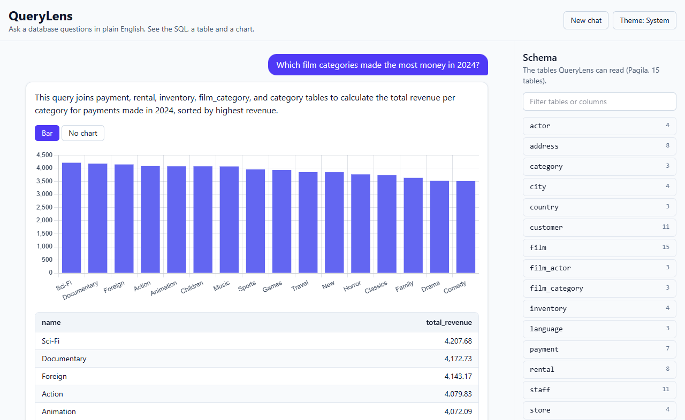
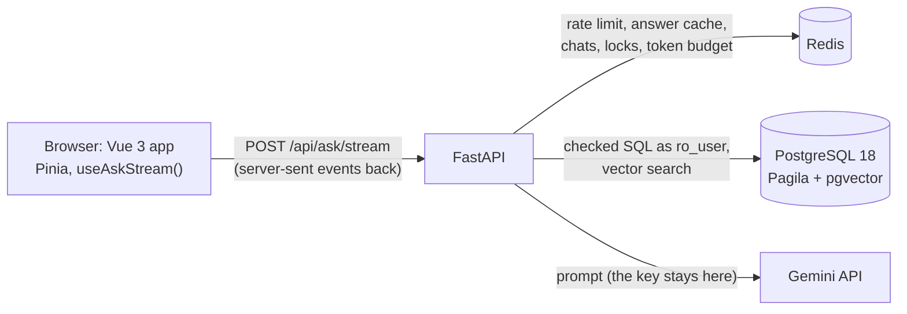

# QueryLens

[](https://github.com/itsvilram/querylens/actions/workflows/ci.yml)

Ask a database questions in plain English. QueryLens writes the SQL, checks that it is safe, runs it as a read-only user, and shows the SQL, a table and a chart, with live progress while it works. Follow-up questions like "only for store 2" are understood from the chat.

**Live demo: [querylens-orcin.vercel.app](https://querylens-orcin.vercel.app)** (Gemini free tier: a small daily quota, so it may ask you to try again later).



<sub>A real answer (dev model `gemini-3.1-flash-lite`) on the Pagila demo database.</sub>

## What makes it more than an LLM wrapper

- **Measured accuracy** on a public benchmark (100 BIRD mini-dev questions), with ablations, confidence intervals and paired tests, and an honest failure analysis. The result so far: none of the "smart" additions beats the plain baseline at this sample size, and the failure analysis shows why.
- **SQL security in layers.** A read-only database role is the real guard; a read-only transaction, timeouts, a row cap and an AST validator come on top. The prompt is not a security layer: tests make the model "obey" an injection and check that the harmful SQL is blocked.
- **Schema retrieval (RAG)** with local embeddings and pgvector, and **self-correction**, both measured, not assumed.
- **Redis patterns:** answer cache (5 ms vs 1.4 s), request coalescing with a lock, a sliding-window rate limit in one Lua script, chat history with a TTL, and a daily token budget that reserves before each call.
- **Live progress over SSE** read with `fetch()` in a Vue 3 app, tested with Vitest + MSW and end-to-end with Playwright.

## Stack

Vue 3 (Composition API) + TypeScript + Vite · Pinia · TanStack Query / Table · Chart.js · Shiki · Tailwind ·
Python 3.12 + FastAPI · sqlglot · asyncpg · PostgreSQL 18 + pgvector · Redis · fastembed · Gemini API (free tier) ·
Docker Compose · GitHub Actions

## How it works



One question goes through these steps (`api/app/pipeline/`); the browser sees each one as a `stage` event:

1. **Rate limit** per IP (sliding window). Over it: HTTP 429 with `Retry-After`, before any work.
2. **Rewrite** a follow-up into one standalone question from the chat history in Redis. A first question skips this.
3. **Answer cache** keyed on that standalone question plus a fingerprint of the schema, prompt, model and settings. A second identical question in flight waits for the first one's answer instead of paying again.
4. **Retrieve** (optional, `SCHEMA_MODE=retrieved`): embed the question locally, pgvector top-k tables, then add the tables on the foreign-key path between them.
5. **Generate** SQL as strict JSON `{sql, explanation, chart_hint}`.
6. **Validate** with sqlglot (pure functions) and add or clamp a `LIMIT`.
7. **Execute** as `ro_user` in a `READ ONLY` transaction with a timeout and a row cap.
8. **Correct:** unreadable JSON, a blocked query or a database error goes back to the model, at most 2 more times.
9. **Visualize:** a pure function picks the charts that fit the column types.
10. **Remember** the turn for follow-ups, and cache the answer.

More detail, with diagrams and design trade-offs: [`docs/overview.html`](docs/overview.html) (download and open it in a browser).

## Results

Measured on 100 questions from BIRD mini-dev (PostgreSQL version), stratified by database and difficulty (seed 20260930), with BIRD's hints ("evidence") on. Model: `gemini-3.5-flash-lite` on the free tier. Metric: BIRD's official execution accuracy (EX): the predicted rows, as a set, must equal the gold rows. Each number comes from one run; the files are in [`api/eval/results/`](api/eval/results).

**Baseline B0 (full schema, no correction, no few-shot): 52/100 = 52%** (95% Wilson interval 42–62%).

| Difficulty | Correct |
|---|---:|
| simple | 19 / 31 (61%) |
| moderate | 26 / 50 (52%) |
| challenging | 7 / 19 (37%) |

### Ablations

"Fixed / broken" compares question by question with B0; p is McNemar's exact test.

| Run | Schema | Self-correction | Few-shot | EX | vs B0: fixed / broken (p) | Prompt tokens (mean) |
|---|---|---|---|---:|---|---:|
| B0 | full | off | off | 52 | — | 815 |
| B0R | retrieved, k = 4 | off | off | 52 | 2 / 2 (p = 1.0) | 728 (−11%) |
| B0C | full | on | off | 52 | 0 / 0 (p = 1.0) | 832 |
| A3 | retrieved, k = 4 | on | off | 52 | 2 / 2 (p = 1.0) | 728 |
| A1 | full | on | on | 52 | 6 / 6 (p = 1.0) | 1,092 (+34%) |
| F | retrieved, k = 4 | on | on | running | | |
| A2 | retrieved, k = 4 | off | on | to run | | |
| S | full, on `gemini-3.8-flash` | on | off | to run | | |

**Every configuration ties.** At n = 100 the 95% interval is about ±10 points, and the few questions that flip do so in both directions, so none of these differences is real. The app therefore uses the cheapest setup with a safety net: full schema + self-correction, no few-shot (same accuracy; few-shot examples made the prompt 34% longer). F, A2 and S are waiting on the free tier's daily quota (S has 20 requests a day) and will be added here.

- **Retrieval** (no LLM calls, [`retrieval.md`](api/eval/results/retrieval.md)): with k = 4 plus foreign-key expansion, all tables the gold SQL needs are found for 90% of questions (96% of tables), using 78% of the full schema's tokens. It saved 11% of prompt tokens at the same accuracy. These databases are small enough to send whole, so retrieval pays off on bigger schemas, not here.
- **Self-correction** only sees errors: in B0C the first try failed on 2 questions and both were turned into SQL that runs, but gave wrong answers. In A1, 4 failed and 1 was rescued.
- **Speed:** LLM time per question p50 / p95 was 4.3 s / 7.0 s in B0 and 1.3 s / 3.8 s in A1 (free-tier latency changes a lot by time of day). Database time p50 / p95: 28 ms / 139 ms. An answer from the Redis cache takes a median **4.9 ms** on the server vs **1,387 ms** for a miss ([`cache_latency.json`](api/eval/results/cache_latency.json)).
- **Cost:** about 920 tokens per question (B0 mean), ₹0 on the free tier.

### Failure analysis

I read all 48 questions B0 got wrong and gave each one main cause:

| Cause | Count | Example |
|---|---:|---|
| Right idea, wrong answer shape: an extra or missing column, or a different row layout | 13 | returned the superhero's name next to the publisher asked for |
| Similar but wrong table or join path | 10 | Formula 1 `results` instead of `driverStandings` |
| BIRD's hint or gold SQL is doubtful, and the model followed the hint | 9 | hint says `'Portuguese (Brasil)'`, gold SQL uses `'Brazil'` |
| Wrong filter value, or a hint not applied | 6 | `'premium'` instead of `'Premium'` |
| Counting: `DISTINCT` or not, ties | 3 | counted rows where the gold counts districts |
| Right number, different precision or type | 2 | `94.03714565004887` vs `94.03714565004888` |
| NULL sort order: Postgres puts NULLs first in `DESC` | 2 | "the youngest driver" became one with no birth date |
| SQL error | 2 | referenced a column through the wrong table alias |
| Declined to answer | 1 | |

Only 3 of 48 failures are errors, which is all self-correction can react to; the other 45 run fine and return the wrong rows. That is why correction adds nothing here, and why the next step is prompt work (answer shape, `NULLS LAST` for top-N) tuned on the other 398 mini-dev questions and re-measured on these 100.

## Security

The model is treated as untrusted input. Every layer has tests (`api/tests/`).

| Layer | What it does |
|---|---|
| Database role | `ro_user` can only `SELECT` the 15 demo tables. Its role defaults: read-only transactions, `statement_timeout` 5 s, idle-in-transaction 10 s, `temp_file_limit` 100 MB (only a superuser can raise it), 20 connections, no temp tables, no `EXECUTE` on public functions. |
| Transaction | Every query runs in a `READ ONLY` transaction with its own timeout, and at most row cap + 1 rows are fetched. |
| AST validator (sqlglot) | One statement; `SELECT`/`WITH` only; no write anywhere (also not in a CTE); no `SELECT … INTO` or `FOR UPDATE`; allow-listed tables only (so no `pg_catalog`); denied functions (`pg_*`, `lo_*`, `dblink`, `*_to_xml`, `set_config`, sequence functions). The SQL that runs is regenerated from the checked tree. 91 test cases. |
| Prompt injection | A fake model that obeys "delete all the films" writes `DELETE FROM film`; the validator blocks it (in tests and in the demo). |
| Rate limit | Sliding window per IP in one atomic Lua script. `X-Forwarded-For` is trusted only from configured proxies, and the edge proxy replaces it: a Docker test showed that appending let fake IPs through. |
| Token budget | A daily token cap in Redis: an estimate is reserved with `INCRBY` before each LLM call and corrected after, so parallel requests can't overspend. |
| Secrets and errors | The API key stays on the server. Clients get a safe message and a request id; details go to the log. A test checks no response ever contains the key. |
| Input and CORS | Questions of 1–500 characters, a checked session id format, CORS limited to an allow-list (empty by default). |

## Hosted demo

The live demo runs on free tiers: **Vercel** (one project with `api/` as its root: the FastAPI app in Mumbai, the built Vue app on Vercel's CDN, same domain), **Neon** (Postgres 18 with the same Pagila data and read-only role, see [`db/neon/`](db/neon)) and **Upstash** Redis (shared with another app, so every key starts with `ql:`). It runs with `DEMO_MODE` (the page says questions go to Google's free tier), a lower daily token budget and a 5-per-minute limit. Vercel replaces `X-Forwarded-For`/`x-real-ip` with the real client address, so the rate limit reads `x-real-ip` (`CLIENT_IP_HEADER`); faked headers were tested against the live site and are ignored.

## Run it locally

You need Docker Desktop, [uv](https://docs.astral.sh/uv/) and Node 24.

**Quick look, no API key:** `docker compose --profile full up -d --build`, then open http://localhost:8080. Without a key the app runs in demo mode: a scripted model answers the example questions, a follow-up, and a prompt-injection attempt that the safety check blocks.

**Development:**

```sh
docker compose up -d                  # Postgres with the Pagila demo data, and Redis
cp api/.env.example api/.env          # set LLM_MODE=real and GEMINI_API_KEY for real answers

cd api && uv sync && uv run uvicorn app.main:app --reload    # API on :8000
cd web && npm install && npm run dev                          # app on http://localhost:5173
```

**Tests:**

```sh
cd api && uv run pytest               # 316 tests: unit, Postgres + Redis integration, API
cd web && npm test                    # 49 component and composable tests (Vitest, MSW)
cd web && npx playwright test         # 6 end-to-end tests on the real stack, fake LLM
```

CI runs all of them, plus ruff, mypy (strict), ESLint, Prettier, vue-tsc and an eval replay on recorded model replies; it never calls the LLM. The evaluation commands are in [`api/README.md`](api/README.md).

## Layout

```
api/app/        FastAPI app: api/ (routes), pipeline/ (one module per step), llm/, store/ (Redis), db/
api/eval/       eval runner, metrics, comparisons, results
api/tests/      unit, integration (Postgres + Redis), API tests
web/src/        Vue 3 app: components/, composables/, stores/ (Pinia), api/ (fetch + SSE), lib/
web/e2e/        Playwright tests
db/             Postgres image: Pagila + the read-only role and its limits
docs/           overview.html (architecture, decisions, results)
```

## Credits

- [Pagila](https://github.com/devrimgunduz/pagila) sample database (v4.1.1), PostgreSQL licence.
- [BIRD mini-dev](https://github.com/bird-bench/mini_dev), CC BY-SA 4.0: J. Li et al., "Can LLM Already Serve as A Database Interface? A BIg Bench for Large-Scale Database Grounded Text-to-SQLs", NeurIPS 2023. The dataset is downloaded by a script and not included in this repository; only the chosen question ids are.
